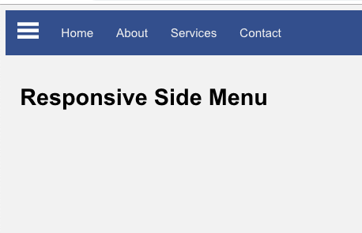
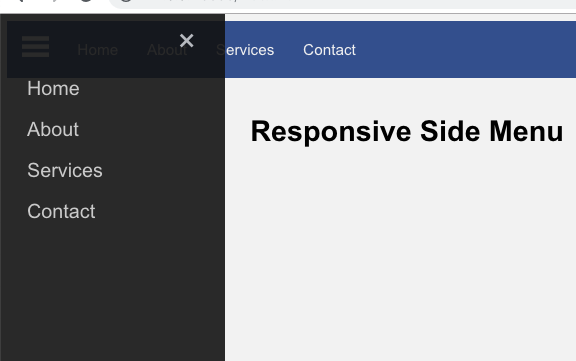
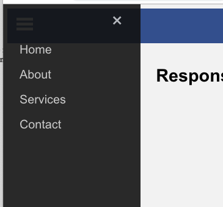

# Responsive HTML & CSS side menu

A responsive side menu built in HTML, CSS and a few lines of JavaScript.

## Screenshots

Side menu not yet clicked:

Side menu clicked:

Responsive top menu:

## Author
* Albert Stjärne (https://github.com/AlbertStjarne)
